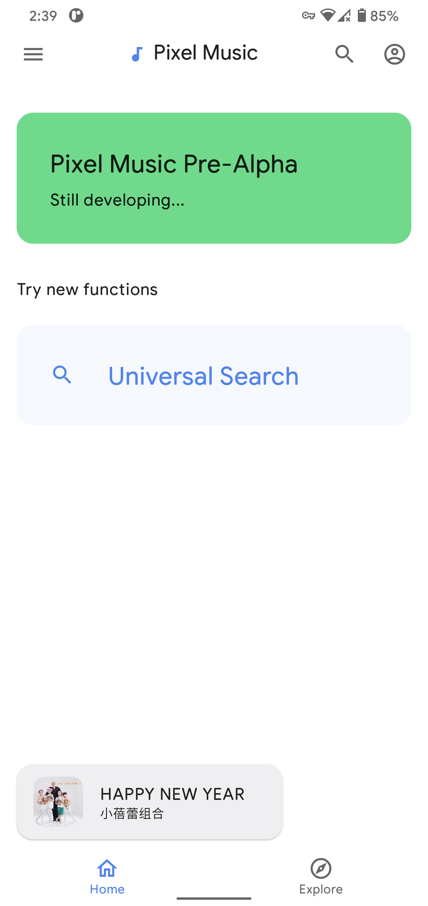
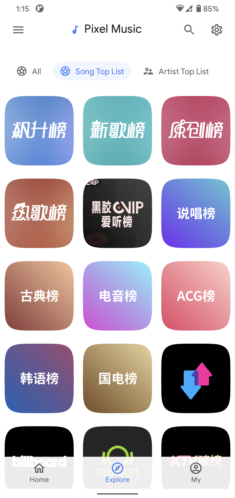
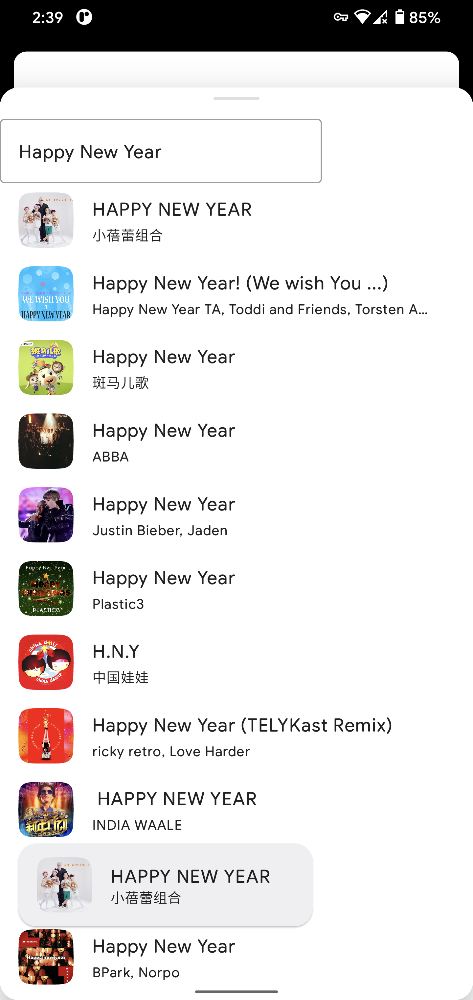
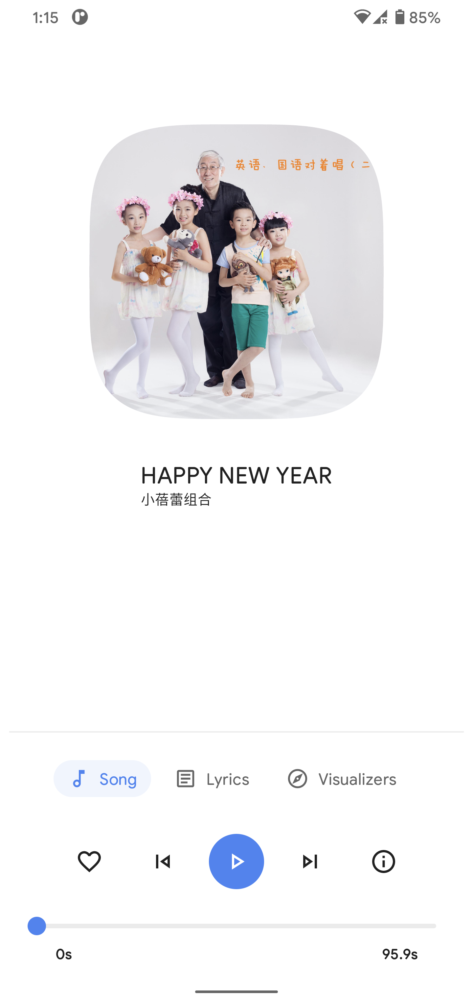

# Pixel Music

This is a beautiful **unofficial NetEase Cloud music player** for Android 🥳!

**Notice:**

* This project is still in progress, which means it is unstable. The features are poor now and
  animations may not be fluent enough.

* I'm so sorry that my application **cannot run on the devices below Android 7**. I temporarily
  adjusted the min sdk version to 24. If you have the crash log on those devices, please send to me,
  so I will be able to resolve the annoying crashes, thank you.

* I won't provide any packages during this **Pre-Alpha stage** due to the instability, you can build
  it in person. Welcome to report issues and pull request.

## Screenshots (2021, Feb 1)

## Major plans

* Thanks to the KMM and Compose, I planned to support more platforms such as MacOS, Windows 10,
  Linux in the near future.

## Technical features

* **Kotlin** 1.4.30-RC
* **Androidx** Snapshot [7119460](https://androidx.dev/snapshots/builds/7119460/artifacts)
* **Jetpack Compose** Snapshot (1.0.0-alpha12)
* **ExoPlayer** 2.12.3

## Build requirements

* **Android Studio** Arctic Fox | 2020.3.1 Canary 5 or higher
* **Gradle** 6.8.1 or higher

## Special Thanks

* **Amplitude Visualization:** [Amplituda](https://github.com/lincollincol/Amplituda)
  by lincollincol

* **Google Sans Rounded
  Font:** [google_sans_plus_font](https://github.com/nongthaihoang/google_sans_plus_font)
  by nongthaihoang
